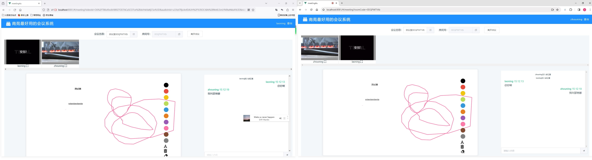

#### 基于srs+socketio+webrtc实现的会议系统
注：本项目是个人学习项目，可能存在着各种Bug,如果您有意愿修复，欢迎提PR.

### 启动服务端meeting
1.将meeting.sql导入至自己的数据库
2.修改application.properties配置中mysql和redis的配置
3.运行Application.java

### 启动srs
参考<https://github.com/ossrs/srs>

### 启动客户端meeting4u
1.修改meeting4u/src/main.js如下配置

```
Vue.prototype.$srsServerAPIURL = 'http://172.16.1.72:1985/';
Vue.prototype.$srsServerRTCURL = 'webrtc://172.16.1.72:8080/live/';
Vue.prototype.$meetingServerURL = "http://172.16.1.72:9898/meeting/"
Vue.prototype.$meetingWebsocketURL = "http://172.16.1.72:9999/"
```

2.进入meeting4u目录执行cnpm install
3.执行npm run serve启动客户端

### 浏览器访问meeting4u地址
1.由于浏览器安全限制必须采用https访问系统才可以获取到系统摄像头和录音设备，如果没有https证书条件，建议使用<http://localhost:port/?#/home访问系统>
2.系统测试账号如下
```
zhouning 111111
laoning 111111
xiaoning 111111
```

### 系统部分截图




